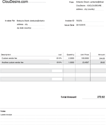

# janine [](https://travis-ci.org/ClouDesire/janine) [](LICENSE.txt) [](https://hub.docker.com/r/cloudesire/janine/) [](https://gitter.im/ClouDesire/janine)
Janine is your sexy generator and archiver of PDF invoices.

## server
A spring boot application that expose a [REST API](API.md), use Redis to maintain counters of the generated invoices, and upload them to a jclouds-supported object storage (tested with Rackspace CloudFiles, but AWS S3, Azure Blob, OpenStack Swift, Atmos should work out of the box).

**Security notice**: there is no security at all. So use this service behind your firewall, or protect it via a simple nginx basic auth, or something similar.

```
docker run \
  -e BLOB_PROVIDER=rackspace-cloudfiles-uk \
  -e BLOB_IDENTITY=username \
  -e BLOB_CREDENTIAL=apiKey \
  -e SPRING_REDIS_HOST=localhost \
  -e SPRING_REDIS_PORT=6379 \
  -e SERVER_PORT=8080 -p 8080:8080 \
  cloudesire/janine
```

A new docker image tag is pushed after each build: [available versions](https://hub.docker.com/r/cloudesire/janine/tags/)

## client
A simple java library to consume the server [REST API](API.md).

(not yet released on maven central)

## invoice preview

We mentioned that the generator is sexy, while the actual invoice may not (de gustibus non est disputandu), but we are happy to accept your contribute if you are a designer with a great invoice template.

[](invoice-preview.pdf)

## credits

* ClouDesire.com (https://cloudesire.com)
